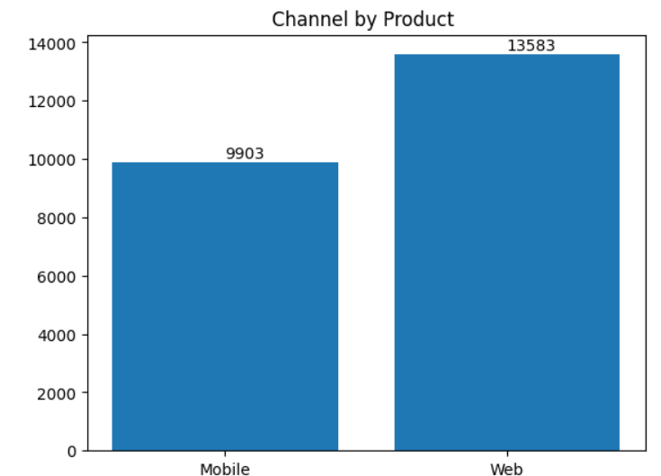
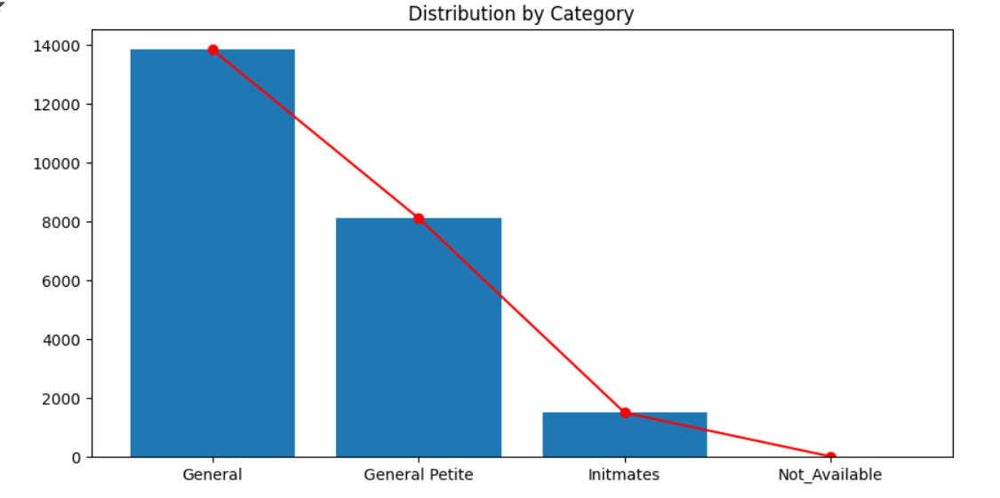
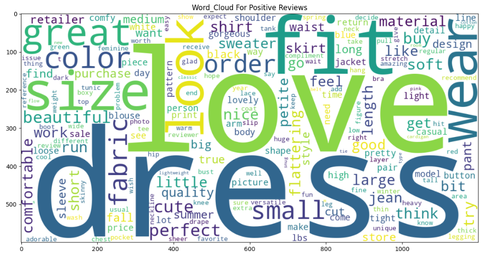
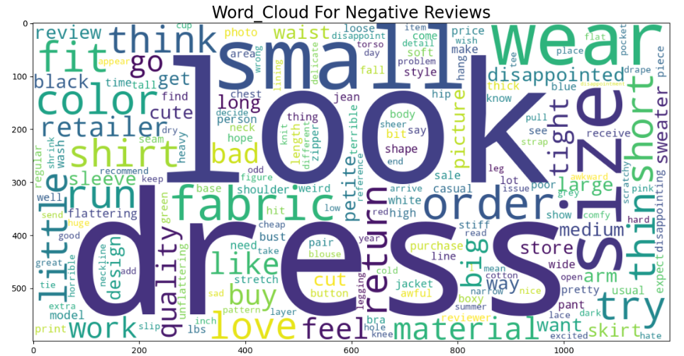

# Customer-Review-Analysis-for-Leading-Women-s-Clothing-E-Commerce-Company
Customer Review Analysis for Women’s Fashion E-Commerce using NLP. Predicts sentiment of reviews and provides actionable insights

Project Title

Customer Review Analysis for Women’s Fashion E-Commerce

Project Overview

This project analyzes customer reviews from a leading women’s clothing e-commerce platform using Natural Language Processing (NLP) and Machine Learning. It predicts the sentiment of reviews (positive, negative, neutral) and provides insights to help the business improve products, services, and customer experience.

Key Features

Text Preprocessing: Clean, tokenize, and lemmatize review text.

Feature Extraction: Convert text to numerical features using TF-IDF or similar techniques.

Machine Learning Models: Train models like Random Forest, Logistic Regression to predict sentiment.

Feature Selection: Use RFE to select important features and improve model performance.

Data Insights: Visualize trends in customer feedback and sentiment distribution.

Accuracy of this model - 0.93%

Technologies Used

Python

Pandas

Scikit-learn

NLP (Text Cleaning, Tokenization, TF-IDF)

WORD_CLOUD ON BASIS OF POSITIVE_REVIEWS

WORD_CLOUD ON BASIS OF NEGATIVE_REVIEWS

